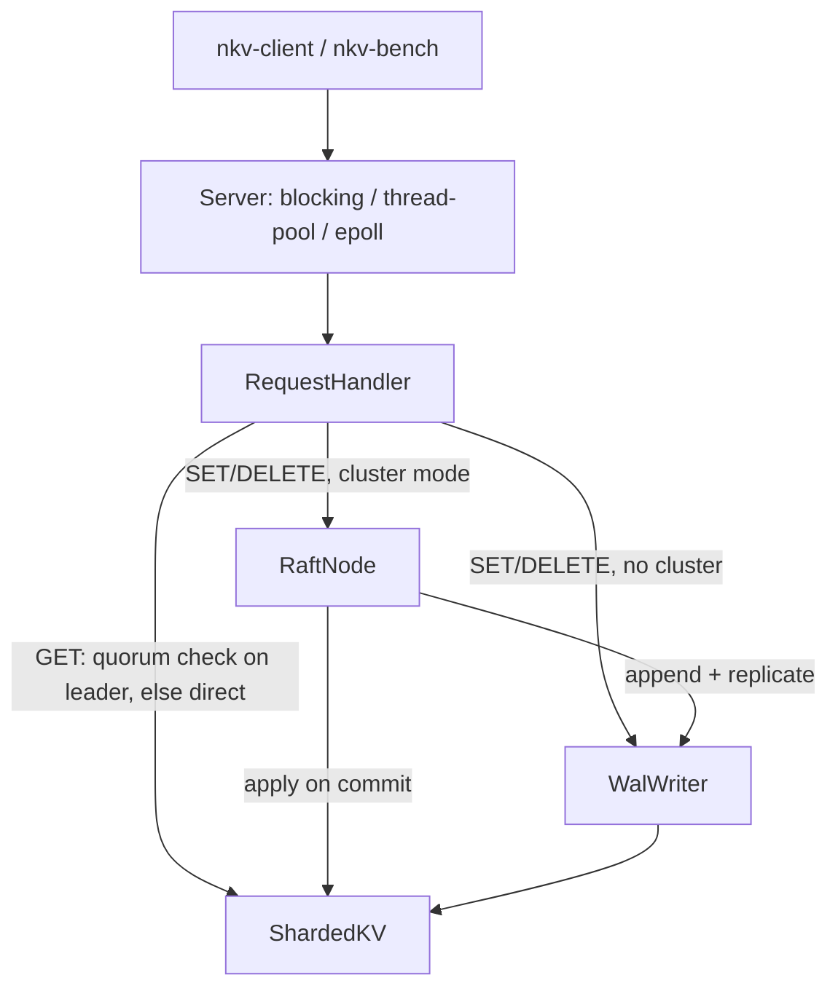

# NeuralKV

NeuralKV is a distributed, in-memory key-value store built from scratch in
C++20: a custom binary TCP protocol, three interchangeable server I/O models
(blocking, thread-pool, epoll), write-ahead-log durability, and Raft-based
replication across a 3-node cluster with linearizable reads. It's a from-
scratch systems project meant to demonstrate the full stack of a real
distributed store — networking, storage, consensus, and the failure testing
and performance work that go with it — not a production database.

## Prerequisites

- CMake 3.20+
- A C++20 compiler (Apple Clang, GCC, or Clang)
- Docker (optional, for Linux builds from macOS)

## Quick Start

```sh
cmake -B build
cmake --build build
ctest --test-dir build --output-on-failure
```

The deployment target is Linux. `./scripts/docker_build.sh` runs the same
build and test suite inside an Ubuntu container, for parity with target
hardware when developing on macOS.

## Architecture



- **Protocol** — framed binary messages; client requests and cluster RPC
  share one port
- **Server** — three interchangeable I/O models, same `RequestHandler`
- **Raft** — election, replication, linearizable reads via quorum confirm
- **Persistence** — write-ahead log with group commit, crash recovery
- **Storage** — sharded, thread-safe in-memory map

More detail in [docs/architecture.md](docs/architecture.md).

## Running a Single Node

```sh
./build/tools/nkv-server/nkv-server --port 7400 --data-dir ./data/node-1 &
./build/tools/nkv-client/nkv-client --port 7400 set hello world
./build/tools/nkv-client/nkv-client --port 7400 get hello
./build/tools/nkv-client/nkv-client --port 7400 delete hello
```

`nkv-server` defaults to blocking I/O. `--io threadpool --workers 8` and
(on Linux) `--io epoll` select the other two server models; all three speak
the identical wire protocol. Every SET/DELETE is appended to a write-ahead
log and `fsync`'d before it's acknowledged, so an acknowledged write
survives a crash — see [docs/wal-design.md](docs/wal-design.md).

## Running a 3-Node Cluster

```sh
./scripts/run_cluster.sh
```

Starts a 3-node Raft cluster on localhost with generated per-node config
files. Raft elects the leader; writes against any other node come back
`WRONG_LEADER` with the current leader's node id, and `nkv-client
--cluster-config <path>` follows that redirect automatically. Reads are
linearizable by default too — a follower's GET also comes back
`WRONG_LEADER`, and the leader confirms it still holds a live quorum before
answering (`--allow-stale-reads` opts back into serving GET from local
storage unconditionally, at the cost of that guarantee). Killing the leader
triggers a new election.

See [docs/architecture.md](docs/architecture.md) for how the pieces fit
together, [docs/raft-design.md](docs/raft-design.md) for how election,
replication, commit/apply, and linearizable reads work, and
[docs/cluster-config.md](docs/cluster-config.md) for the config file format
and client redirect behavior.

## Benchmarking

```sh
./build/tools/nkv-bench/nkv-bench --bench --host 127.0.0.1 --port 7400 \
    --duration 30 --clients 16
```

Point `nkv-bench` at a running server or Raft leader to measure throughput
and latency percentiles. The project has been benchmarked in stages, each
isolating one architectural change: a blocking-TCP baseline, thread pool and
epoll I/O models, WAL durability, Raft replication, failover recovery, and
two profile-driven optimizations (WAL group commit and read-quorum
amortization). See [docs/benchmark-methodology.md](docs/benchmark-methodology.md)
for the full stage-by-stage numbers and how each was measured, and
[docs/benchmarks/results/](docs/benchmarks/results/) for the raw output
behind every number.

The two optimization passes are the highlights: batching concurrent WAL
fsyncs into group commits took single-node write throughput up **3.01x**
and turned the write path from "more concurrent clients doesn't help" into
one that actually scales with concurrency; skipping a Raft leader's quorum
round trip on reads that already have recent majority contact took
read-only throughput up **12.2x** and the standard 80/20 mix up **1.53x**,
without weakening linearizability. [docs/performance-notes.md](docs/performance-notes.md)
covers the bottlenecks that were measured, what was fixed, and one
optimization (connection reuse) that was evaluated and deliberately not
implemented.

## Failure Testing

```sh
./scripts/run_fault_tests.sh
```

Builds if needed and runs just the fault-injection and failure-scenario
suites — leader crash, network partition, delayed RPCs, concurrent clients
across a leader change, and single-key linearizability under load — instead
of the full test suite. See [docs/failure-testing.md](docs/failure-testing.md)
for the failure model this covers and what's out of scope (no
`iptables`/network namespaces, no scripted fault schedules, no full
Jepsen-style checker).

## Platform Notes

Linux is the deployment target; macOS is supported for local development.
Code that depends on Linux-only APIs (epoll, etc.) is gated behind the
`NEURALKV_LINUX` compile definition, set automatically when building on
Linux.
