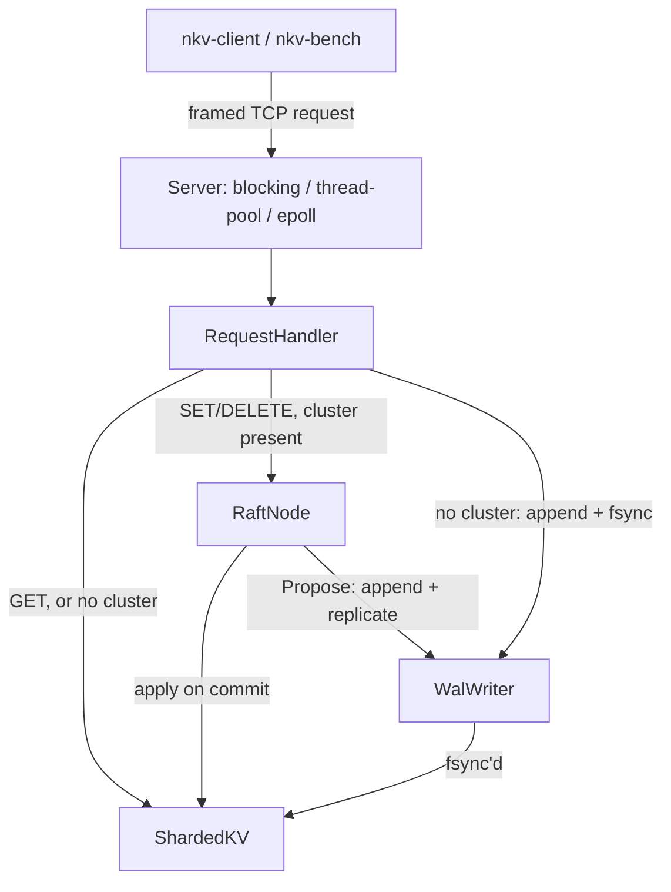

# Architecture

How a request moves through NeuralKV, top to bottom.

## Layers

- **Protocol** (`src/protocol/`) — a binary frame codec shared by client
  requests and node-to-node cluster RPCs, distinguished by `MessageType`.
  One TCP port and one framing format for both.
- **Net** (`src/net/`) — three interchangeable server I/O models
  (`BlockingServer`, `ThreadPoolServer`, `EpollServer`) that all decode the
  same frames and hand them to the same `RequestHandler`. Swapping I/O
  models never changes behavior, only concurrency.
- **Server** (`src/server/`) — `RequestHandler` applies a decoded request to
  storage and builds the response. It's the one place that knows whether a
  `RaftNode` is present and routes accordingly.
- **Raft** (`src/raft/`) — `RaftNode` owns leader election, log replication,
  and commit/apply when running as part of a cluster. `raft::Log` is backed
  directly by the node's WAL rather than a separate file.
- **Persistence** (`src/persistence/`) — `WalWriter` appends and fsyncs
  records (batched via group commit); `DurableStorage` ties the WAL to the
  in-memory store and replays it on startup.
- **Storage** (`src/storage/`) — `ShardedKV`, a sharded, thread-safe
  in-memory map. The bottom of the stack; nothing below it.

## Write path

Without a `RaftNode`, `RequestHandler` calls `DurableStorage::Set`/`Delete`
directly: append to the WAL, sync it durable, apply to `ShardedKV`, return.
With a `RaftNode`, the handler instead calls `RaftNode::Propose()`, which
appends the entry to the node's Raft log (the same WAL, now carrying a real
term), replicates it to a majority, and only then applies it — the client
sees `OK` only once the write is durable on a majority and visible locally.
A node that isn't the current leader rejects SET/DELETE with
`WRONG_LEADER` rather than touching storage.

## Read path

GET never touches the WAL — recovery has already replayed everything
fsync'd by the time a server accepts connections, so reading straight from
`ShardedKV` is always current for whatever's been applied. Without a
`RaftNode`, that's the whole story. With one, GET is linearizable by
default: a follower always rejects with `WRONG_LEADER`, and a leader first
confirms it still holds a live quorum (skipping that round trip when recent
heartbeat contact already proves it) before trusting its own local state.
`--allow-stale-reads` skips both checks in exchange for possibly-stale
reads on a lagging follower.

## Cluster RPC

Node-to-node RPCs (`RequestVote`, `AppendEntries`, and a liveness ping)
share the exact same TCP port and frame format as client requests,
distinguished by `MessageType`. `ClusterTransport` dials a fresh connection
per RPC rather than caching one — a held-open connection under Raft's
continuous heartbeat traffic would otherwise monopolize a single-threaded
server's one serving slot.

## See also

- [raft-design.md](raft-design.md) — election, replication, commit/apply,
  linearizable reads, and known limitations in detail.
- [wal-design.md](wal-design.md) — record format, recovery, and group
  commit.
- [cluster-config.md](cluster-config.md) — config file format and client
  redirect behavior.
- [failure-testing.md](failure-testing.md) — how the failure model above is
  exercised under injected faults.
- [performance-notes.md](performance-notes.md) — measured bottlenecks and
  the optimizations applied to fix them.
